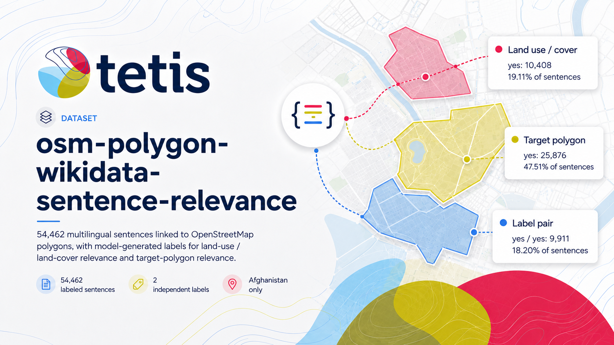

<!-- layout: title-sidebar -->
<!-- valign: bottom -->
<!-- notes: [Sources] Project README; https://github.com/NoeFlandre/osm-polygon-wikidata-sentence-relevance; https://huggingface.co/datasets/NoeFlandre/osm-polygon-wikidata-sentence-relevance -->

# Two release lanes for one sentence-level dataset

Research overview

Noé Flandre

V1 Afghanistan · V2 worldwide

The project turns OSM-linked article sections into reproducible sentence rows, then adds explicit model labels without changing the source text.

---

<!-- layout: title-banner -->
<!-- notes: [Sources] Project README; docs/reference/labeling.md -->

# V1 is a published proof of concept; V2 keeps the same contracts while widening the sample

The central distinction

V1 fixes one complete Afghanistan artifact. V2 is a separate worldwide sampling lane, stored below `v2-worldwide/` so V1 remains intact.

---

<!-- columns: 50/50 -->
<!-- notes: [Sources] Project README, sections “V1 dataset release” and “V2 worldwide stratified labeling”; Hugging Face dataset links in slide text. -->

## V1 is small enough to audit and large enough to use

54,462

Labeled sentence rows

161

Unique OSM polygons

115

Language codes

|||

### The published Afghanistan artifact (V1)

The first public release is the complete Afghanistan labeling run. It is public on the Hugging Face dataset and remains the stable reference point for later work.

Strong-positive yield, where both V1 questions are yes: 18.20%.

[Open the V1 dataset](https://huggingface.co/datasets/NoeFlandre/osm-polygon-wikidata-sentence-relevance)

---

<!-- columns: 45/55 -->
<!-- notes: [Sources] V1 data lineage and source dataset are documented in README.md and docs/reference/data-contract.md. -->

## Every row starts from the OSM-linked source dataset

1. `osm-polygon-wikidata-only` supplies polygons, article documents, and sections.
2. Deterministic joins connect polygon IDs to Wikipedia and Wikivoyage sections.
3. SaT segmentation produces candidate sentences.
4. Normalization, boundary repair, and exact deduplication produce stable rows.
5. The labeling stage adds decisions while retaining the original sentence and metadata.

|||

The input dataset is the upstream source for both the sentence table and its provenance.

[View the upstream dataset](https://huggingface.co/datasets/NoeFlandre/osm-polygon-wikidata-only)

---

<!-- rows: 38/62 -->
<!-- notes: [Sources] docs/guides/grid5000.md and docs/reference/labeling.md; model and prompt identifiers are read from the project defaults. -->

## V1 asks two independent questions about each sentence

The V1 model sees the target sentence, its neighbors, polygon name and region, language, page and section title, the OSM primary tag, and all stored OSM tags. It must return closed labels, reason codes, and an exact evidence excerpt.

===

Land use or land cover?

Does the sentence describe how land is used, managed, built upon, protected, cultivated, or physically covered?

The target polygon?

Does it describe, identify, locate, or characterize the named place itself?

Runtime: unsloth/Qwen3.6-27B-MTP-GGUF, Q4_K_M file, served by llama.cpp on remote CUDA hardware.

---

<!-- layout: section-break -->
<!-- title: center -->
<!-- notes: [Sources] docs/reference/labeling.md and README.md -->

## V2 changes the question, not the provenance contract

---

<!-- columns: 50/50 -->
<!-- notes: [Sources] docs/reference/labeling.md, “V2 stratified sampling and place-description labeling”. -->

## V2 samples the world by place, language, and map context

200,000

Default target rows

H3 res. 3

Global geographic strata

One label

`place_relevance` per sentence

|||

### Deterministic continuation

Rows are grouped by H3 cell, language, and OSM primary tag. A seeded proportional prefix chooses the sample. Raising the target keeps the earlier selection and adds rows instead of reshuffling it.

Missing coordinates, languages, and tags remain explicit strata. V2 is published below `v2-worldwide/`; it cannot replace V1 root files.

---

<!-- columns: 50/50 -->
<!-- notes: [Sources] src/osm_polygon_sentence_relevance/labeling/prompt.py and docs/reference/labeling.md. -->

## V2 asks whether the sentence describes the place itself

### A positive answer

The sentence gives a visual or geographic description: terrain, landscape, land or water cover, soil, ecosystems, vegetation, visible structures, or physical setting.

### A negative answer

It is about history, administration, people, events, economy, transport, navigation, links, or another place without describing the target place physically.

The model returns yes, no, or uncertain, one reason code, and an exact substring of the target sentence.

---

<!-- columns: 50/50 -->
<!-- notes: [Sources] README.md, docs/reference/labeling.md, and the public repository links below. -->

## The release boundary is designed for inspection

### Stable today

- V1 Afghanistan files are public and unchanged.
- Input, model, prompt, and output hashes are recorded.
- Cards and plots are generated from the final Parquet table.

### The V2 lane

- Worldwide sampling and one-label place description are implemented.
- Checkpoints, asynchronous mirrors, and release prefixes keep continuation safe.
- Worldwide results are a separate release, not a rewrite of V1.

---

<!-- layout: title-banner -->
<!-- notes: [Sources] All links are public project endpoints. -->

# Read the data, method, and implementation together

Public entry points

[GitHub repository](https://github.com/NoeFlandre/osm-polygon-wikidata-sentence-relevance)  ·  [MkDocs documentation](https://noeflandre.github.io/osm-polygon-wikidata-sentence-relevance/)  ·  [V1 Hugging Face dataset](https://huggingface.co/datasets/NoeFlandre/osm-polygon-wikidata-sentence-relevance)

[V1 Trackio](https://huggingface.co/spaces/NoeFlandre/afghanistan-labeling-trackio)  ·  [V2 Trackio](https://huggingface.co/spaces/NoeFlandre/worldwide-stratified-labeling-trackio)

The Hugging Face card records the dataset license and provenance. The source repository remains the canonical record for code and documentation.

